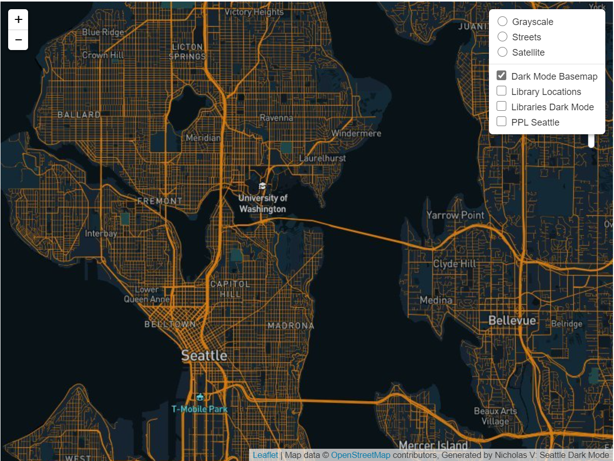
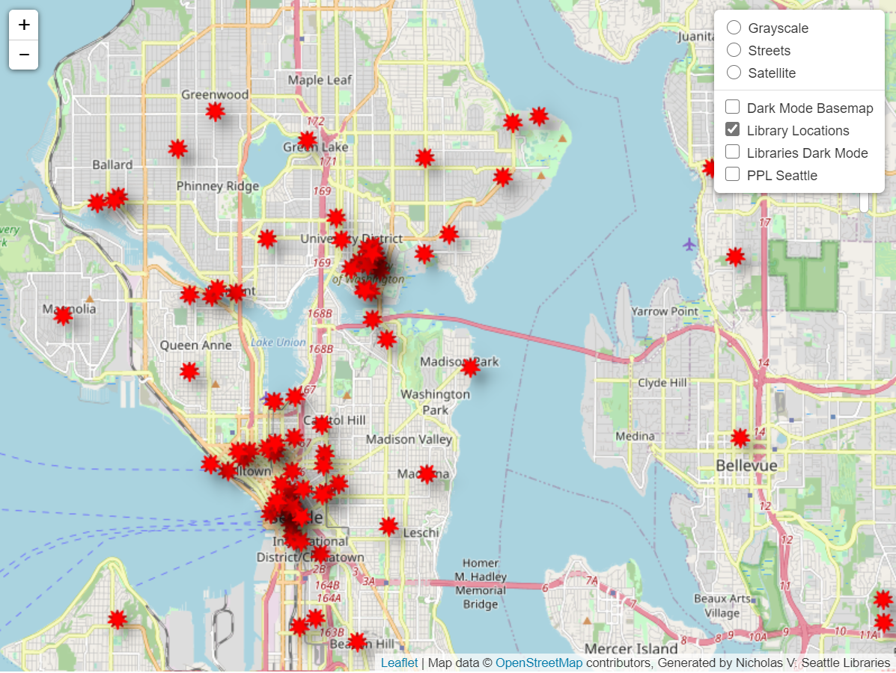
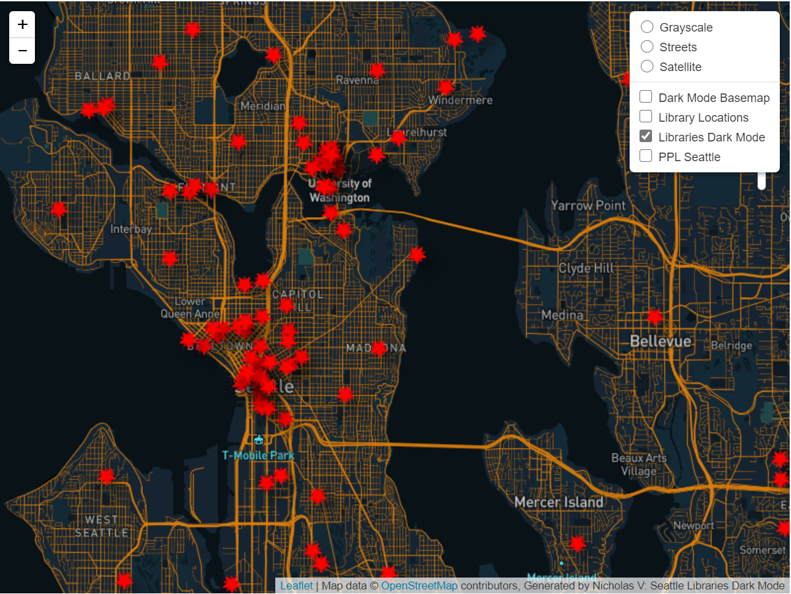
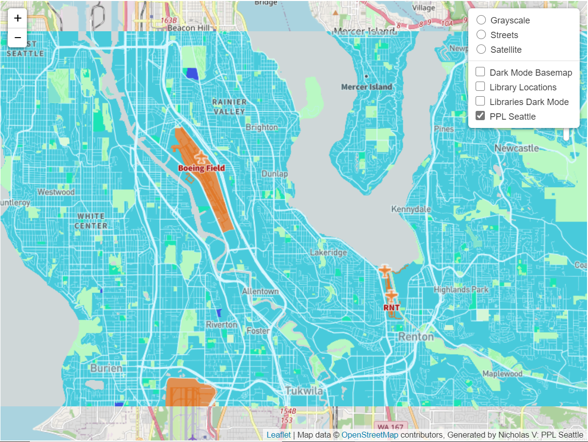

# Map Tile Screenshots

## Tile 1: Dark Mode

* This map shows the Seattle area in the a low light background to reduce
stress on the eyes and highlights areas of interest.
* Geographic Area of Focus: Seattle, WA
* Zoom Levels: Max Zoom - 14; Min Zoom - 10

## Tile 2: Library Locations

* This map highlights libraries within the Seattle area with a bright red marker
that can't be missed.
* Geographic Area of Focus: Seattle, WA
* Zoom Levels: Max Zoom - 14; Min Zoom - 10

## Tile 3: Library Locations in Dark Mode

* This map combines the library geospatial data with the low brightness basemap.
* Geographic Area of Focus: Seattle, WA
* Zoom Levels: Max Zoom - 14; Min Zoom - 10

## Tile 4: PPL Seattle

* This map provides a calm background of cool colors and contrasts it with airfields
and landing strips from which pilots could take off and land. This map is particularly
useful to anyone with a pilot's license and wishes to know where airfields can be found.
* Geographic Area of Focus: Boeing Airfield, WA
* Zoom Levels: Max Zoom - 14; Min Zoom - 10
